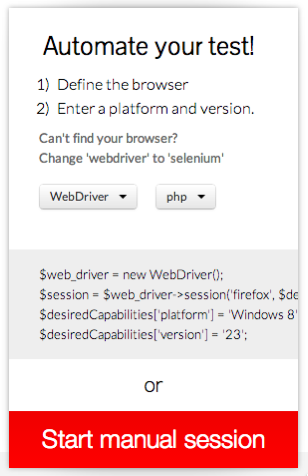

# Testing Multiple Browsers Using SauceLabs

If you run any sort of website, whether it's just for sales & marketing or as your main product, cross-browser testing - both desktop and mobile - is an essential part of your approach to high quality.  Your website is your shop window, and if potential customers run into problems _before_ they've spent any money with you, do you think they're likely to become paying customers?

Traditionally, cross-browser testing meant maintaining your own set of Windows images (which takes a fair bit of effort), and firing up each one to test your website by hand.  They were two time-consuming and error-prone processes.  Testing tools such as Storyplayer now make it easy to automate your browser tests, but that still leaves the overhead of maintaining your collection of browser versions and platforms, right?

That's where [Sauce Labs](http://saucelabs.com) comes in.

Sauce Labs provides [a hosted collection of browser versions and platforms](https://saucelabs.com/docs/platforms), so that you don't have to maintain these yourself.  Their collection includes the usual suspects (Internet Explorer, Firefox and Chrome) on various versions of Microsoft Windows, plus Safari on OS X, and browsers running on Linux too (handy if your target audience are software engineers).  They've also recently started providing mobile browsers too.  (They also have useful features such as recording videos of each test run, and recording screenshots too, which can be very helpful when a test works in one browser but fails in another).

Sauce Labs isn't free, but we use it here at DataSift because (for us) it's a lot cheaper than maintaining our own collection of browser versions and platforms to use in cross-browser testing.  Storyplayer now includes Sauce Labs support.

## Getting Started

Here's what you need to run your tests using Sauce Lab's browsers instead of browsers running on your desktop machine:

* Sign up for a Sauce Labs account
* Your Sauce Labs username
* Your Sauce Labs access key

Your _Sauce Labs username_ is the username that you use to log into the Sauce Labs website, and you'll find your _Sauce Labs access key_ in the left-hand sidebar on the _Accounts_ page.

You need to add your Sauce Labs details to your Storyplayer config file.


{
	"environments": {
		"defaults": {
			"saucelabs": {
				"username": "<saucelabs-username>",
				"accesskey": "<saucelabs-accesskey>"
			}
		}
	}
}


(Tip: for private repos, it's fine to put them in the main [storyplayer.json](../../configuration/storyplayer-json.html) file, but for public repos, it's best to add them to your [per-user config file](../../configuration/user-config.html) instead).

Make sure you've installed the latest version of Storyplayer (to get the latest features and bug fixes), and that you're run `storyplayer install` to download dependencies such as _browsermob-proxy_ and _Sauce Connect_.

Finally, before you use Storyplayer's Sauce Labs integration for the first time, make sure that your test works with a web browser that is running on your own desktop.  This will save you a lot of time :)

## Running A Test

Running a test via Sauce Labs is very similar to running a test against a browser on your own desktop:

* use the `--usesaucelabs` switch to tell Storyplayer to talk to Sauce Labs instead of the local Selenium server
* use the `-b` switch to tell Sauce Labs which browser you want
* use the `-Dwebbrowser.*` switches to tell Sauce Labs which platforms and browser versions you want

For example, here's how to run a test using Internet Explorer 9 on Windows 7 via Sauce Labs:


storyplayer -b 'internet explorer' --usesaucelabs -Dwebbrowser.platform='Windows 7' -Dwebbrowser.version=9 stories/registration/signup/RegisterUsingRegistrationFormStory.php


## Selecting A Browser

The list of available browsers at Sauce Labs is constantly changing, as they add support for new browsers and drop support for obsolete versions.  As a result, we can't give you a comprehensive list of Storyplayer command-line switches to use for each browser.

However, it's very easy to work out the switches required for each browser version:

1. Go to [Sauce Lab's list of supported platforms](https://saucelabs.com/docs/platforms)
1. Click on the operating system you want to test against
1. Click on the specific browser version you want to test against

On the right-hand side of the page, you'll see a helpful box called _Automate Your Test!_.  This box contains two dropdowns.  Make sure the first dropdown says _Webdriver_, and that the second dropdown says _PHP_.

At this point, you'll see a code snippet that looks something like this:


$web_driver = new WebDriver();
$session = $web_driver->session('firefox', $desiredCapabilities);
$desiredCapabilities['platform'] = 'Windows 8';
$desiredCapabilities['version'] = '23';


This is example code for use with their own WebDriver library.  We just need to convert this into Storyplayer command-line switches:

* The first parameter to `$web_driver->session()` is the browser name.  Pass this to Storyplayer using the `-b` switch.
* Every entry in the `$desiredCapabilities` array needs passing to Storyplayer using the `-D webbrowser.*` switches.

The example code becomes:


storyplayer --usesaucelabs -b 'firefox' -Dwebdriver.platform='Windows 8' -Dwebdriver.version='23'


If you have trouble running your tests via Sauce Labs, always check first to make sure that you've got the right switches on the command-line, and that you haven't missed any out.  If you have, Sauce Labs won't know which browser you're asking for!

## Testing Websites Behind Your Firewall

Sauce Lab's browsers normally connect to websites over the internet.  If you are trying to test a website that is firewalled off from the internet (or maybe on private IP addresses in your office), then you'll need to use Sauce Connect.

[Sauce Connect](https://saucelabs.com/docs/connect) is a network tunnel and HTTP proxy combined into a single JAR file.  Storyplayer will download it for you; you just need to start it up before you run any tests:


vendor/bin/storyplayer install
vendor/bin/browsermob-proxy.sh start
java -jar vendor/bin/Sauce-Connect.jar <saucelabs-username> <saucelabs-accesskey> -p localhost:9091


Just wait for it to say _Connected! You may start your tests._, and then you can run your Storyplayer tests, and Sauce Labs will automatically reconfigure its browsers to make their network connections through Sauce Connect.

If you don't use Sauce Connect for a period of time, it will automatically shut itself down.  It's also a good idea to restart it periodically (Sauce Labs call this keeping it 'fresh').

## Testing Websites Behind HTTP Basic Auth

At the time of writing, Selenium WebDriver (the technology Storyplayer uses to control web browsers) does not provide working support for authenticating via HTTP Basic Auth.  To get around this, when you run tests against a browser on your own desktop, we proxy the web browser through browsermob-proxy, which can inject the HTTP Basic Auth credentials for us.

If your website requires HTTP Basic Auth, then you need to use the Sauce Connect tunnel to test your website.  This is true even if your website is on a public IP address.  Sauce Connect will use the locally-running browsermob-proxy, which allows us to inject the HTTP Basic Auth credentials.


vendor/bin/browsermob-proxy.sh start
java -jar vendor/bin/Sauce-Connect.jar <saucelabs-username> <saucelabs-accesskey> -p localhost:9091


Your test will need to tell Storyplayer which HTTP Basic Auth credentials to use, by calling [`$st->usingBrowser()->setHttpBasicAuthForHost()`](../../modules/browser/usingBrowser.html#sethttpbasicauthforhost).

## Known Differences Between Sauce Labs And Local Selenium WebDriver

We've observed a few differences between running tests using web browsers on your own desktop (ie using Selenium WebDriver locally) and running tests using web browsers running at Sauce Labs.  We'll keep this section up to date as we find more differences between the two.

### Browsers Can Persist Between Test Phases

When your test runs against a browser on your own desktop, every test phase starts with a completely fresh browser, with all cookies reset.  We do this for two reasons: to isolate your test phases properly (so that they are more reliable), and because (if you have a test that takes a long time to run) the browser may have timed out anyways.

However, with Sauce Labs, we've noticed that every test phase does not always start with a completely fresh browser.  As a result, you will need to adjust your test to cope with things such as cookies already being set, and potentially still being logged into your website.

### Performance Can Vary At Times

According to Sauce Labs documentation, their web browsers are running inside virtual machines on their infrastructure.  At busy times of the day, the hosted browsers can sometimes run slower than a browser running on your own desktop (especially if your desktop is a decent spec with tonnes of RAM and SSDs).  _This isn't a fault with Sauce Labs, just a natural consequence of using virtualised services._

This will affect any tests which have timeouts (such as waiting for a page to load).  For now, just adjust the timeouts.  A future version of Storyplayer will include some more help with this.

Our advice is to use Sauce Connect tunnels for functional testing, but to use Storyplayer in combination with a local web browser when you want to test that your website is fast enough.

### Using Sauce Connect Slows Down Your Tests

Sauce Lab's Sauce Connect is a network tunnel.  It allows web browsers running on their network to see web servers running on your network.  This means that network traffic goes like this:

    Sauce Labs     Internet         Your Network        Your Network and/or Internet
    ----------     --------         ------------        ----------------------------
    web browser -> Sauce Connect -> browsermob-proxy -> web server -> -\
    web browser <- Sauce Connect <- browsermob-proxy <-----------------/

If your connection to the internet is asymetrical (ie, you're on broadband, with different up and down speeds) or simply slow, then this is going to slow down your tests a bit.  How much depends on the speed of your connection to the internet, and how congested that is at the time that you run your tests.

Our advise is to use Sauce Connect tunnels for functional testing, but to use Storyplayer in combination with a local web browser when you want to test that your website is fast enough.